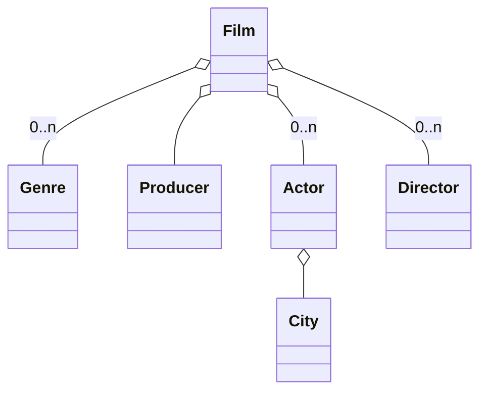
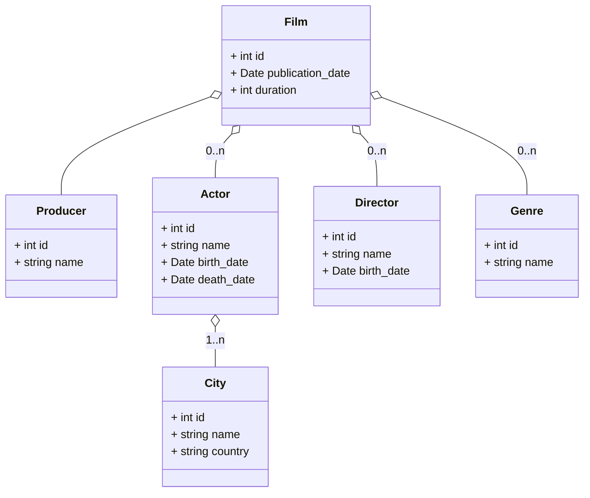

# FilmDB
## Modelo de dominio
Partimos del siguiente modelo de dominio:

## Historias de usuario
### Consulta de películas
Como usuario quiero poder consultar las películas que hay en
el sistema, para ello quiero poder consultar por los campos:
- Título
- Género
- Actor/es
- Director/es
- Fecha de publicación

### Edición de Actores y Directores
Como usuario quiero poder buscar Actores y Directores así como
editar sus datos, los datos de consulta serían:
- Para actores
  - Nombre del actor
- Para directores
  - Nombre del director

### Comando de carga de datos
Como usuario quiero poder cargar los datos desde un fichero
CSV con el formato:
- Id IMDB
- Title
- Original Title
- Year
- Date Published
- Genre
- Duration
- Country

## Diseño de base de datos
Las tablas que creamos a partir de los datos y el modelo de
dominio son:

# Decisiones técnicas
## Tipos de datos en la BB.DD.
En base de datos he utilizado el tipo int para los ids, si fuese una API habría que evaluar si utilizar un tipo
de datos UUID para los ids que se expusiesen en los endpoints de la API. Para lograr el máximo rendimiento en 
consultas es recomendable utilizar int para ids en tablas sobre las que se hagan JOIN o consultas relacionadas.